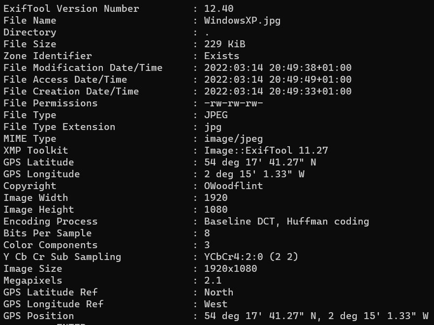
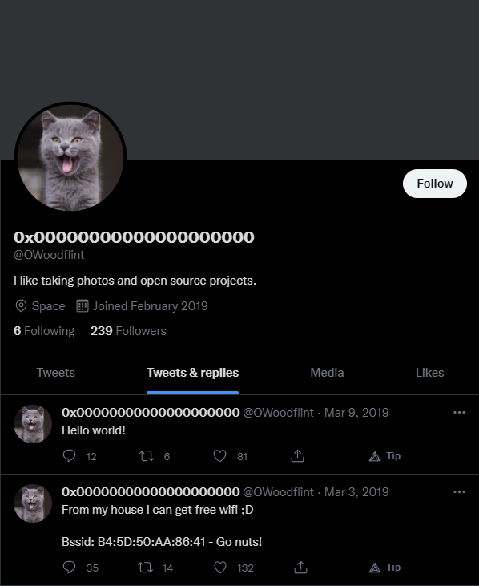
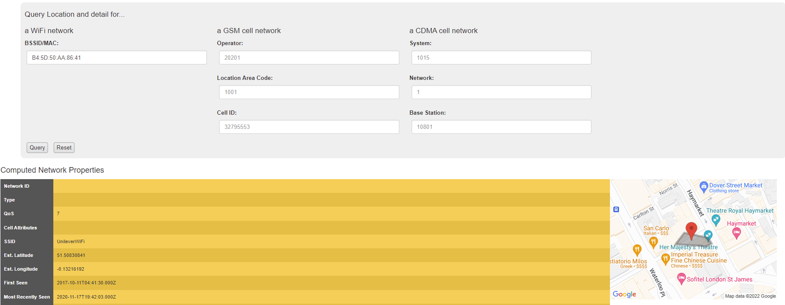
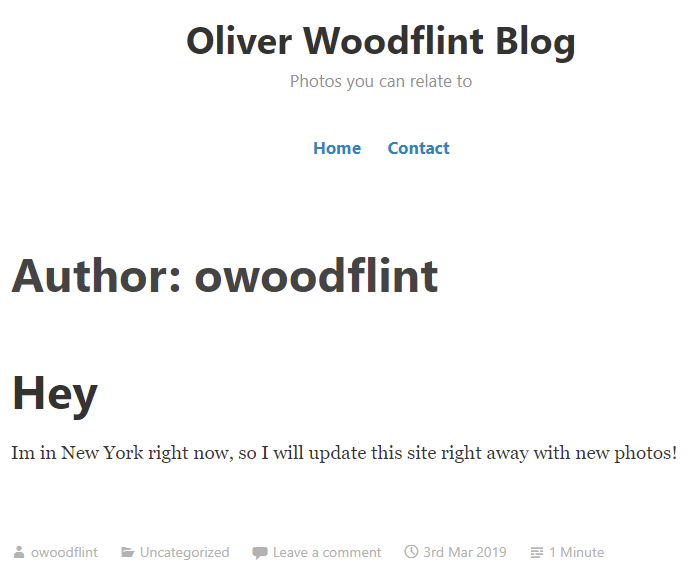

# OhSINT

In this challenge we only get one file, called "WindowsXP.jpg". Now with this single file we'll try to solve all the questions possible.

## Getting Started

When we open the file, there is no useful information to be seen on the image itself. So let's use `exiftool` to extract all the information from the image. Exiftool gives this information: 

There is a `copyright` tag, this is the author of the file. Let's do a quick search on Google. 

## Searching the Internet

Here we find that "OWoodFlint" has a Twitter page, a Blog, and a Github page.

### **Twitter**

The user posted interesting information of a BSSID. It is easy to search more information about the BSSID using [Wigle](https://wigle.net). When searching `B4:5D:50:AA:86:41` on Wigle we can find the SSID of the Access Point (AP) and the location of it. In this case it is located in "London".

### **Github**

On the Github page we find the e-mail of the user: `OWoodflint@gmail.com`.

### **Blog**

When going to the blog we can see that "OWoodflint" was in `New York` on 3rd March 2019.

