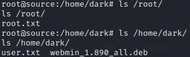

# Source

This machine has a pretty recent vulnerability which we will exploit.

## Scanning

When scanning, we can see that there are 2 ports open. This machine has `ssh` and `Webmin` running. 

```
PORT      STATE SERVICE VERSION
│22/tcp    open  ssh     OpenSSH 7.6p1 Ubuntu 4ubuntu0.3 (Ubuntu Linux; protocol 2.0)
| ssh-hostkey: 
|   2048 b7:4c:d0:bd:e2:7b:1b:15:72:27:64:56:29:15:ea:23 (RSA)
|   256 b7:85:23:11:4f:44:fa:22:00:8e:40:77:5e:cf:28:7c (ECDSA)
|_  256 a9:fe:4b:82:bf:89:34:59:36:5b:ec:da:c2:d3:95:ce (ED25519)
10000/tcp open  http    MiniServ 1.890 (Webmin httpd)
|_http-title: Site doesn't have a title (text/html; Charset=iso-8859-1).
Service Info: OS: Linux; CPE: cpe:/o:linux:linux_kernel
```

## Webmin

By looking into the "Webmin" page a bit more, we know it is version `1.890`. Knowing this we can search the internet for existing exploits of this version. In this case we are lucky and there is actually an exploit for this version `CVE-2019-15107`. In metasploit there is a module `exploit/linux/http/webmin_backdoor` which we will use. Once ran, we get a shell as the user `root` which means we can do anything and extract all the information we need.

